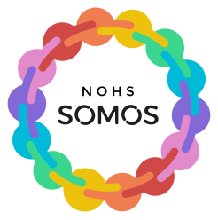

   
  
  <h4>🏳️‍🌈 Nohs Somos 🏳️‍🌈</h4>
  

 

# Somos Test Api

Este é um projeto de testes que usa Python 3.8 com Poetry e Django para criar uma API backend.

- [Python](https://www.python.org/)
- [Poetry](https://python-poetry.org/docs/cli/)
- [Django Rest Framework](https://www.django-rest-framework.org/tutorial/quickstart/)

## Contribuindo

Para contribuir para esse projeto, por favor, faça um fork do projeto e depois crie um PR em direção a main. Seu PR será avaliado e mergeado caso esteja bom.

Todo PR precisa conter testes unitários e de integração. 

Seus commits precisam ser feitos usando [commits semânticos](https://www.conventionalcommits.org/en/v1.0.0/).